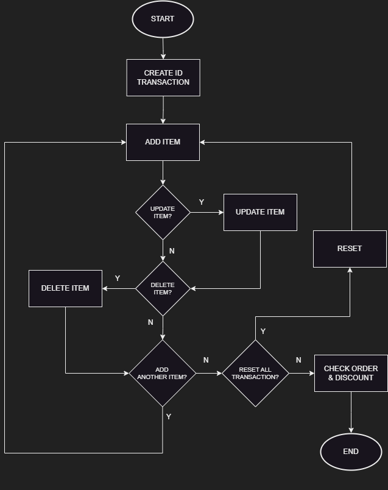

# SUPER-CASHIER SERVICE (Project)

Sistem layanan kasir self-service berbasis bahasa pemrograman Python
oleh DM Erdy Kusuma

## Backgound
Sebuah perusahaan supermarket ingin mengembangkan layanan mereka dengan menyediakan sistem kasir self-service. Customer bisa memasukan item yang dibeli ke sistem kasir secara mandiri. Customer juga bisa mengakses fitur lain termasuk menampilkan total belanja hingga diskon yang diperoleh.   

## Objectives
1. Sistem bisa membuat ID transaksi yang unik
2. Customer bisa menambahkan nama item, jumlah item, dan harga per item yang dibeli ke dalam keranjang belanja
3. Customer bisa mengubah nama item atau jumlah item atau harga per item untuk item yang sudah ada dalam keranjang belanja
4. Customer bisa membatalkan/ menghapus salah satu item di keranjang belanja
5. Customer bisa melihat daftar item dalam keranjang belanja
6. Customer bisa reset seluruh transaksi
7. Customer bisa menampilkan total belanja dan diskon
8. Sistem bisa menghitung besaran diskon yang diberikan berdasarkan ketentuan:
    - Jika total belanja lebih besar dari 500.000 maka diskon yang didapat 10%
    - Jika total belanja lebih besar dari 300.000 maka diskon yang didapat 8%
    - Jika total belanja lebih besar dari 200.000 maka diskon yang didapat 5%
    - Jika total belanja di bawah dari 200.000 maka tidak mendapat diskon  

## Code Requirements
1. Dibangun secara modular .py
2. Menerapkan clean code (PEP8)
3. Menyertakan dokumentasi Docstring
4. Menerapkan try, error di branching
5. Menerapkan penggunaan library atau method di Python

## Flowchart
Alur sistem yang dibangun adalah sebagai berikut: 

## Code Explanation

### **Features**
Sistem kasir ini dihadirkan lewat interface sederhana berbasis menu yang bisa dibuka melalui terminal.

1. Tambah Item: untuk menambah nama, jumlah, dan harga per item
2. Ubah Item: untuk mengubah nama atau jumlah atau harga item
3. Hapus Item: untuk menghapus satu item di keranjang belanja berdasarkan nama item
4. Reset Transaksi: untuk reset atau menghapus semua item di keranjang belanja
5. Cek Total Belanja & Diskon: untuk menampilkan seluruh item di keranjang belanja dan besaran diskon yang didapat
6. Keluar: untuk menutup aplikasi

### **Class/ Method**

1. Item: 
Class untuk mendefinisikan item yang memiliki atribut nama item (name) bertipe string, jumlah/ kuantitas item (qty) bertipe integer, dan harga item (price) bertipe float. Pembuatan class memanfaatkan modul Dataclasses.

2. Transaction: 
Class untuk mengelola transaksi dan keranjang belanja. Menginialisasi ID transaksi (transaction_id) dan keranjang belanja (cart). ID transaksi dibuat secara unik dan acak dengan memanfaatkan modul Uuid. Keranjang belanja diinisialisasi dalam bentuk list. 

3. add_item(): 
Method untuk menambahkan item ke keranjang dengan atribut nama item, jumlah item, dan harga item. Jumlah item dan harga item yang dimasukkan Customer akan dikonversikan ke int dan float. Nama item akan disimpan dalam format "title case" untuk keprluan validasi dan menampilkan keranjang belanja.

4. update_item_name(): 
Method untuk memperbarui nama item dalam keranjang. 

5. update_item_qty(): 
Method untuk memperbarui jumlah item dalam keranjang berdasarkan nama item yang dimasukkan. Jumlah item yang dimasukkan Customer akan dikonversikan ke integer. 

6. update_item_price(): 
Method untuk memperbarui harga item dalam keranjang berdasarkan nama item yang dimasukkan. Harga item yang dimasukkan Customer akan dikonversikan ke float. 

7. delete_item(): Method untuk menghapus satu item di keranjang belanja berdasarkan nama item yang dimasukkan. Saat proses berhasil akan muncul pesan "'Nama item' berhasil dihapus!". 

8. reset_transacion(): 
Method untuk menghapus/ reset semua transaksi. 

9. total_price(): 
Method untuk mendefinisikan ketentuan diskon serta menghitung total belanja setelah dikurangi diskon yang diperoleh Customer. 

10. check_order(): 
Method untuk menampilkan isi keranjang belanjang dalam bentuk tabel yang memanfaatkan library Tabulate.

### **Error Handling**

- Muncul pesan saat keranjang masih kosong. 

- Muncul pesan jika tipe data yang dimasukkan Customer tidak sesuai tipe data atribut yang didefinisikan pada class Item.

- Muncul pesan jika nama item yang dimasukkan tidak ditemukan di keranjang.

## Test Cases

### *1. Customer menambahkan dua item baru:* 
- Nama Item: Ayam Goreng, Jumlah Item: 2, Harga per Item: 20000
- Nama Item: Pasta Gigi, Jumlah Item: 3, Harga per Item: 15000

### *2. Customer menghapus item "Pasta Gigi":*

### *3. Customer ingin menghapus semua item di keranjang atau reset transaksi:*

### *4. Customer ingin menghitung total belanja yang harus dibayarkan:*

## Conclusion
Sistem kasir yang dibuat telah lolos 'test case' yang diberikan. Untuk pengembangan, keranjang belanja bisa disimpan dalam tipe data Dictionary. Mekanisme validasi perlu diperbanyak untuk meminimalisasi kesalahan masukan dari Customer. Perlu juga untuk menambahkan tanggal transaksi dan menu yang bisa mengatur/ memperbarui ketentuan diskon. Untuk kebutuhan data yang lebih besar, bisa dipertimbangkan mekanisme penyimpanan data base berbasis server. 
